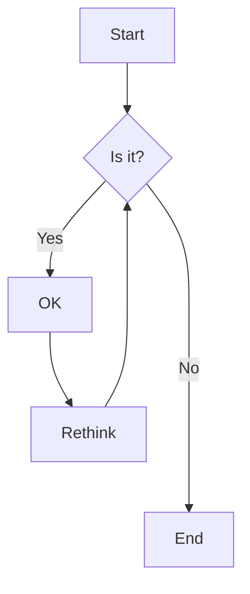
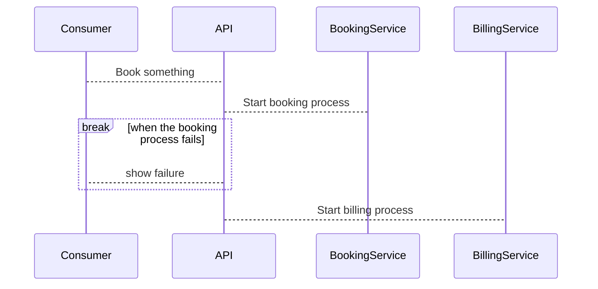
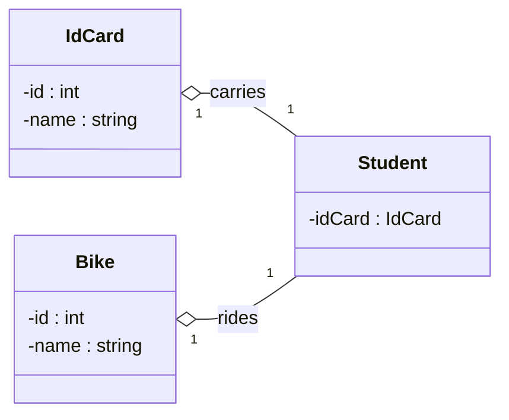
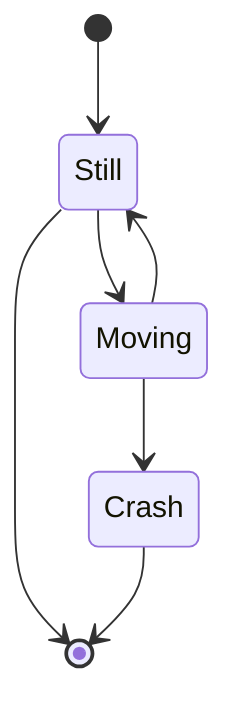

Diagrams can be made with the interal [Mermaid tool](https://mermaid.js.org/). Examples of the various diagrams can be found [here](https://mermaid.js.org/syntax/flowchart.html)

## flowchart

## sequence

## class

## state

